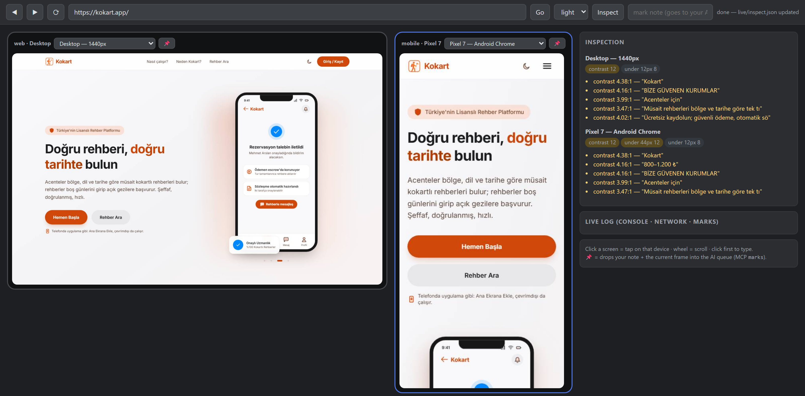

# uisight

[](https://github.com/sololabstr/uisight/actions/workflows/ci.yml)
[](https://www.npmjs.com/package/uisight)

**Your AI can already see the screen. It just can't measure it.**

Screenshots make an agent *guess*: "that heading looks a bit faint." uisight makes it **know**:

```diff
- from a screenshot:  "the heading looks a little washed out, maybe adjust the color?"
+ from uisight:       INVISIBLE TEXT 1.04:1 — span.bg-gradient-to-r "your headline"
+                     (text rgba(255,255,255,.5) / bg rgb(247,247,248))
```

One is an impression. The other is a measurement with a selector attached — the agent fixes *that* element instead of hunting for it.

uisight is an [MCP](https://modelcontextprotocol.io) server for **web and responsive UIs** (Claude Code, Cursor, Antigravity, anything that speaks MCP). It runs live mobile + desktop sessions side by side, measures what it finds, and puts you and the agent in front of the exact same screen.

Built by a solo founder who got tired of taking phone screenshots, pasting them into chat, and typing "the button looks broken, can you see it?"


*The live panel: desktop + mobile sessions of the same site, URL-synced. Inspect runs on every screen; findings come back per device. Your AI sees this exact view through MCP.*

## What makes it different

| | Multi-viewport browsers<br>(Polypane etc.) | Browser tools / computer use<br>(Playwright MCP, agent harnesses) | Native app toolkits<br>(Argent etc.) | **uisight** |
|---|---|---|---|---|
| Measures the UI (`1.14:1`, not "looks low") | ✅ for humans | — | — | ✅ **as text, for the agent** |
| Human + agent share one live session | — | — | — | ✅ |
| Device × theme matrix in one run | ✅ | — | — | ✅ |
| Human pins a bug → agent reads note + frame | — | — | — | ✅ |
| Native iOS/Android apps | — | — | ✅ | — (web only) |

The measurement engine is the heart: instead of your AI burning tokens squinting at screenshots, `inspect` returns findings like

```
[mobile · Pixel 7 · light] https://yourapp.com/
  INVISIBLE TEXT 1.04:1 — span.bg-gradient-to-r "your headline" (text rgba(255,255,255,.5) / bg rgb(247,247,248))
  BUTTON a.text-white "Get Started" → text/background contrast 3.35:1
  touch target below 44px 180x23 — "read the guide"
```

Text findings are cheap, precise, and directly actionable — your AI fixes the exact selector instead of guessing.

## "My agent already does this"

Fair — and partly true. Computer use, browser tools and most agent harnesses can already open a page and take a screenshot. That's the part uisight doesn't try to replace. Three things are still missing:

**1. Looking isn't measuring.** A vision model reading a screenshot cannot tell you a contrast ratio. It can't tell 4.6:1 (fine) from 4.3:1 (fails WCAG AA) — they look identical. It won't notice that a tap target is 41px instead of 44px, or that an element renders identically in light and dark mode because its color is hard-coded. uisight computes these from the live DOM: alpha-composited backgrounds, gradient text, `oklch()` colors and all.

**2. Screenshots cost more and say less.** A mobile screenshot is roughly 1,500 tokens of pixels the model has to interpret. The equivalent `inspect` result is a few hundred tokens of facts it can act on directly. Someone put it perfectly under the launch thread: *"it burns some tokens but it manages."* This is the version that doesn't burn them.

**3. Nobody's watching with you.** In the usual setup the agent looks at the page alone and reports back. Here you both watch the same live session — you see what it does as it does it, and when *you* spot something, you pin it (📌) with a note and the agent reads your note plus that exact frame. No more describing a bug in words.

Scope note: uisight is for **web and responsive UIs**. For native iOS/Android app control, [Argent](https://github.com/software-mansion/argent) is excellent and does far more than we do there.

## Quickstart

```bash
# one-shot audit: PNGs + gallery + report for iPhone/Pixel/desktop, light+dark
npx uisight https://yourapp.com --theme both

# live panel: mobile + desktop side by side, you browse, AI watches (and vice versa)
npx uisight-panel http://localhost:3000
```

The one-shot audit produces a device × theme gallery with findings per card:


### Hook it into your AI (MCP)

```bash
# Claude Code
claude mcp add --scope user uisight -- npx -y uisight-mcp
```

For Cursor / Antigravity / other MCP hosts, add to your MCP config:

```json
{ "mcpServers": { "uisight": { "command": "npx", "args": ["-y", "uisight-mcp"] } } }
```

Then just tell your agent: *"look at my app with uisight"*. The panel server starts automatically when needed.

## MCP tools

| Tool | What it does |
|---|---|
| `see_screen` | Returns the current screen as an image — the exact frame the human sees in the panel |
| `inspect` | Runs contrast / touch-target / overflow / theme checks; returns **measured findings as text** |
| `goto` | Navigates all sessions to a URL (localhost included) |
| `tap` / `type_text` / `scroll` | Drives the page — the human watches it happen live |
| `set_device` | Switches device profile (iphone-15, iphone-se, pixel, galaxy, ipad, desktop, laptop) or light/dark theme |
| `status` | Open URL, sessions, recent console/network errors — first stop when hunting a bug |
| `marks` | Reads the notes the human pinned in the panel (📌 note + screenshot at that moment) |

Turkish tool names available with `UISIGHT_LANG=tr` (`ekrani_gor`, `denetle`, ...).

## The panel (human side)

`npx uisight-panel <url>` opens a browser page at `localhost:5055`:

- **Mobile + desktop side by side**, both live, URL-synced
- Click = tap on that device · wheel = scroll · type after clicking
- Per-pane device switcher, shared light/dark toggle
- **Inspect** button runs the measurement engine on every screen
- **📌 Pin**: type a note, pin it — your AI reads note + screenshot via `marks`. No more "let me describe what I'm seeing."

Works inside VS Code / Antigravity via *Simple Browser: Show* → `http://localhost:5055`.

## What it checks

- Invisible text (contrast < 1.6:1) and WCAG AA contrast failures — alpha-composited backgrounds, gradient text, `oklab()`/`oklch()` colors all handled
- Touch targets below 44px (mobile profiles only; inline text links exempt by width, per WCAG)
- Horizontal overflow with the offending elements
- Text below 12px, images without alt
- **Theme drift**: elements identical in light *and* dark = likely hard-coded colors
- Console/JS errors and failed network requests per device

And the honest limit: automated checks cannot see *design* mistakes — a collided header measures fine. That's why `see_screen` exists and why the report says "eyeball the PNGs."

## Something didn't work?

Please open an issue — even a one-liner. This is a young project and the fastest way it improves is someone saying "I ran it on X and got Y". Screenshots of the panel or the contents of `REPORT.md` help a lot.

Known rough edges, so you can tell a bug from a limitation:

- **Design mistakes are invisible to the engine.** A header that collides with the logo measures perfectly fine. Use `see_screen` and look.
- **Photo backgrounds are skipped.** Contrast over a background image can't be computed from CSS, so those elements are left alone rather than guessed at.
- **Theme drift samples structural elements** (body, header, nav, main, footer, button, a, input, cards/panels/modals/menus) — drift that lives only in body copy won't show up in the light↔dark comparison.
- **iPhone profiles are WebKit, not an iOS Simulator** — very close to Safari, not identical to a device.
- **Internals are still Turkish.** Public surfaces (tools, CLI flags, reports) are English; variable names inside `src/` aren't yet. PRs welcome either way.

## Development

```bash
npm install
npx playwright install chromium
npm test          # runs the inspection engine against fixture pages in a real browser
```

The tests are regression locks: every case in `test/inspect.test.mjs` is something the engine got wrong at least once — a false "clean" verdict, a false alarm, or a measurement that silently skipped a color format.

See [CONTRIBUTING.md](CONTRIBUTING.md) before touching the measurement engine — it explains why the color math cannot be extracted into a module, and what a good bug report looks like.

## Notes & limitations

- iPhone profiles run on real WebKit (Safari's engine) — close to iOS, but not an iOS Simulator.
- Browsers are downloaded once by Playwright on first run (`npx playwright install chromium webkit` if you want to pre-warm).
- Everything runs **locally** — no cloud, no account, your screens never leave your machine.
- As of v0.2 the codebase is English throughout — identifiers, comments, and the panel's HTTP field names. If you were calling the panel API directly, [CHANGELOG.md](CHANGELOG.md) has the rename table.

## License

MIT © [SoloLabs](https://sololabs.com.tr)
